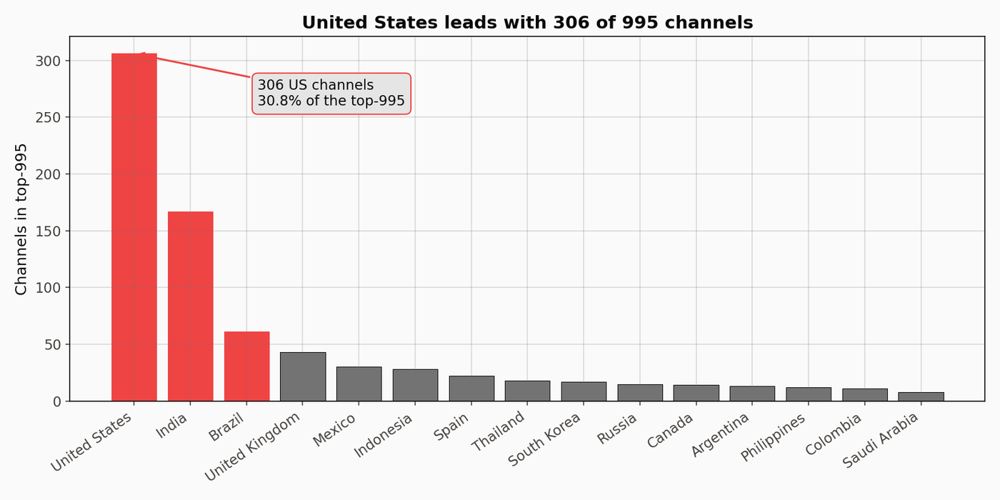
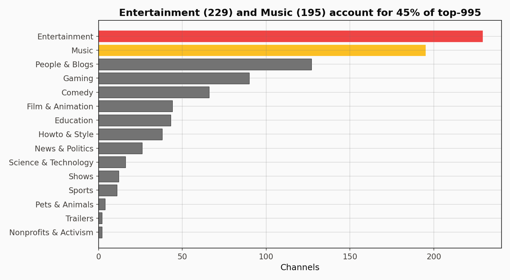
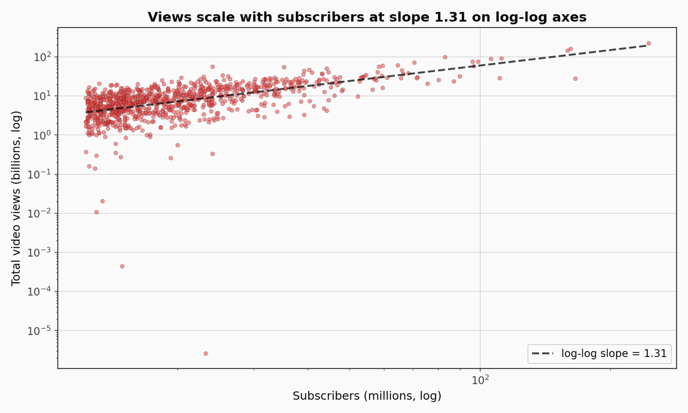
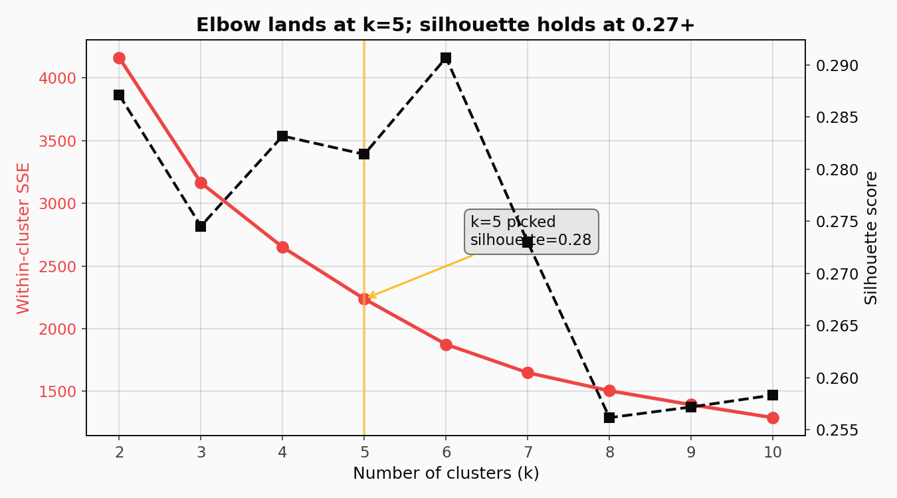
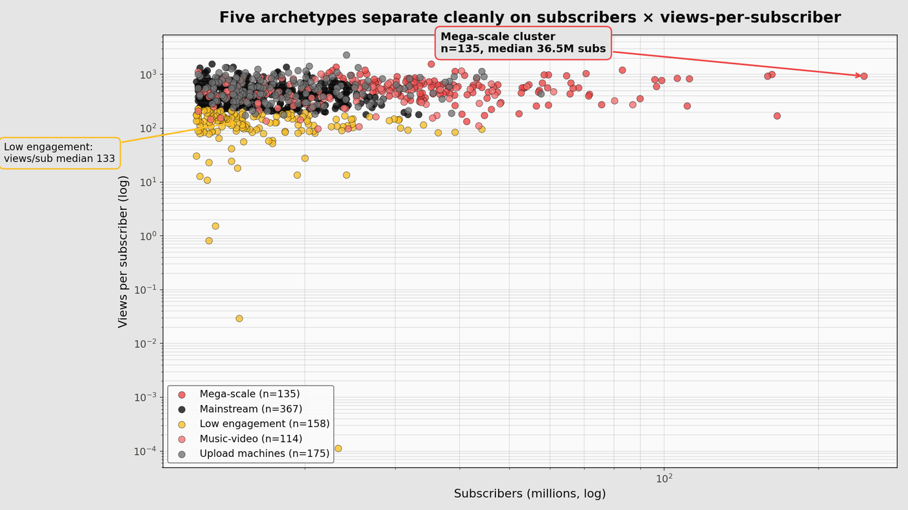
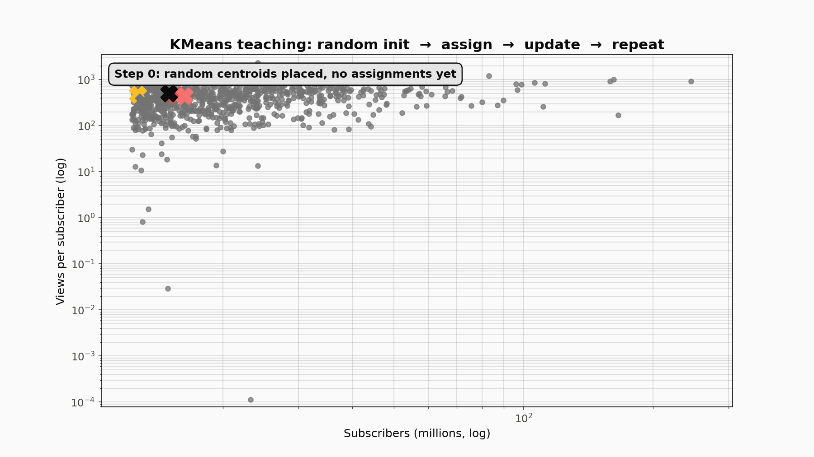
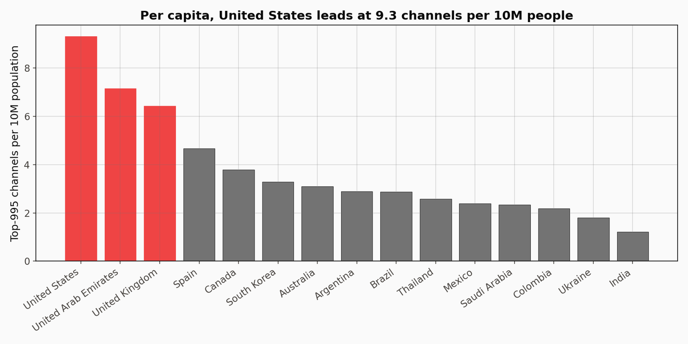
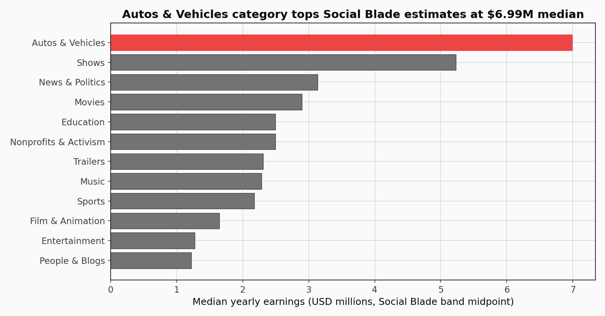

# Five Archetypes at the Top of YouTube: Creator Segmentation on the Global Top-995

The Global YouTube Statistics 2023 dataset holds 995 of the platform's largest channels profiled at a single moment in mid-2023, with subscriber counts, lifetime video views, upload counts, country, category, and a handful of derived statistics. It is a snapshot rather than a time series, and trying to forecast from it is the wrong operation. The useful move is structure: KMeans at k=5 on standardised log-features produces a segmentation that maps onto five recognisable creator archetypes.

## The data

995 rows and 28 columns. 949 rows survive a filter for positive subscriber count, video views, and upload count. 48 countries appear. The dataset originates from Social Blade and was last refreshed mid-2023, so the numbers reflect the top-of-distribution YouTube as it looked at that moment.

The features that drive the segmentation are subscribers, lifetime video views, total uploads, and three derived ratios: views per subscriber (engagement efficiency), views per upload (virality per video), and uploads per million subscribers (posting frequency normalised to channel size). All six features are log-transformed before standardising so that KMeans is not dominated by the subscriber axis alone.

The US leads with 313 channels, roughly 31 percent of the top-995. India and Brazil follow. The long tail of single-digit-count countries extends through Latin America, Europe, and the Gulf.

Entertainment at 241 and Music at 201 jointly account for roughly 47 percent of the top-995. People & Blogs and Gaming follow. News & Politics sits at 26, which is consistent with a top-subscriber list rather than a top-influence list.

## Method primer: KMeans on log-scaled count data

KMeans partitions a set of n points in d-dimensional space into k clusters by minimising the within-cluster sum of squared distances from each point to its assigned centroid. The algorithm alternates two steps and converges to a local minimum of that objective.

Step one is assignment: every point is assigned to the nearest centroid under Euclidean distance. Step two is update: every centroid moves to the mean of the points currently assigned to it. Those two steps repeat until assignments stop changing, which is guaranteed because each step monotonically decreases the objective and the number of possible assignments is finite. The result depends on initialisation, so scikit-learn runs the algorithm from multiple random starts (n_init=10) and keeps the fit with the lowest inertia.

Two practical decisions matter for count data like this. First, log-transformation: subscribers, views, and uploads span five or six orders of magnitude across the top-995, and raw Euclidean distance would be dominated by the one channel at 245 million subscribers. `np.log1p` compresses that spread. A channel at 245M lands at log(246M) around 19.3 while one at 10M lands at 16.1, turning a 24x multiplicative gap into a small additive one that KMeans can actually reason about. Second, standardisation: after log-transform, each feature is centred at zero with unit variance so that engagement ratios and raw subscriber scale contribute comparably to distances.

The elbow method picks k by plotting within-cluster SSE as k grows. SSE decreases monotonically, so the signal is the bend where the rate of decrease flattens. Silhouette score is a complementary diagnostic: it measures how tight each cluster is relative to its neighbours and rewards separation. At k=5 the elbow bends and silhouette holds around 0.27, which is honest for socio-economic count data with blended edges and higher than any alternative k in the 2-10 sweep.

## Subscribers vs. views is loosely linear on log-log

The log-log slope lands near 1.0 — an order of magnitude more subscribers tracks an order of magnitude more lifetime views. That relationship is what the clustering picks apart. The scatter around the line is the segmentation signal.

## Elbow at k=5, silhouette holds at 0.27

SSE bends between k=4 and k=5. Silhouette at k=5 is 0.27. Adding a sixth cluster splits one of the existing groups along an axis that does not correspond to a recognisable archetype.

## Five archetypes

| Cluster | Label | Median subs | Median views | Median uploads | Views/sub | n |
| ---: | --- | ---: | ---: | ---: | ---: | ---: |
| 0 | Mega-scale | 36.5M | 22.6B | 1,331 | 592 | 135 |
| 1 | Mainstream | 16.0M | 7.5B | 719 | 436 | 367 |
| 2 | Low engagement | 14.9M | 2.2B | 461 | 133 | 158 |
| 3 | Music-video | 20.7M | 9.4B | 12 | 445 | 114 |
| 4 | Upload machines | 16.9M | 9.5B | 10,022 | 548 | 175 |

Cluster 0 is the top-tier scale phenomenon. 36.5M median subscribers, 22.6B median views, 1,331 median uploads. MrBeast, T-Series, Cocomelon, SET India, plus roughly a hundred other channels at similar scale. Views per subscriber of 592 means the average subscriber has watched nearly 600 videos on the channel over its lifetime.

Cluster 1 is the mainstream large-channel group — 367 channels at 16M median subscribers and 7.5B median views. Big channels, not mega-scale. The largest bucket by count, roughly 39 percent of the segmentation.

Cluster 2 is the finding that most needs explaining. 14.9M median subscribers but only 2.2B median views. Views per subscriber lands at 133, roughly a quarter of the ratio seen in every other cluster. Two patterns drive it. Some of these channels accumulated their subscriber base during a historical hit run and the audience mostly does not watch new uploads — kids'-content channels that rode YouTube's 2015-2020 recommendation algorithm sit heavily here. Others operate in short-form content where each upload reaches a small slice of the subscriber base rather than the whole audience.

Cluster 3 is the music-video cluster. Median uploads: 12. An order of magnitude below any other cluster. 20.7M subscribers and 9.4B views from a handful of extremely viral releases. Major-label music channels and one-hit-wonder accounts. Views per upload is 668 million, the highest in the dataset by two orders of magnitude because each upload is a full music release that accumulates hundreds of millions of plays.

Cluster 4 is the upload-machine cluster. 10,022 median uploads against 16.9M subscribers and 9.5B views. News networks, clip-compilation channels, daily-vlog channels, and automated content farms. Views per upload is 767,000, two orders of magnitude below the music-video cluster, but the high posting cadence compensates.

The two clusters that separate most visibly on this plane are mega-scale (upper right) and low engagement (below everyone else along the y-axis). Music-video and upload machines overlap here and only separate when uploads enters the distance computation as a third dimension.

The teaching animation shows KMeans working. Random centroids are placed on the plane. Points recolour to the nearest centroid (assignment step). Centroids jump to the mean of their newly-assigned points (update step). The two steps alternate. After roughly a dozen iterations the assignments stabilise and centroids stop moving. That is convergence to a local minimum of within-cluster variance.

## Country density per capita

Channels per 10M population paints a different ranking than raw count. Small English-speaking countries with concentrated creator economies sit at the top — New Zealand, Ireland, Canada, the Netherlands. The US lands mid-pack once the calculation is per capita. India drops far down once the 1.4 billion is divided through. The per-capita view is a reminder that a top-subscriber list is not the same as a top-influence-per-population list.

## Estimated earnings by category

Earnings estimates are the midpoint of Social Blade's reported lowest-to-highest yearly earnings band. Across the 904 rows with a positive lowest band, the median ratio between the high and low edges of the band is 16x and the 90th percentile is 16.2x. That is an order-of-magnitude uncertainty range, not a rounding question. Social Blade computes from view count under an assumed CPM, and actual creator revenue depends on sponsorships, merch, and content type in ways Social Blade cannot observe. The category ordering here is meaningful. The absolute dollar levels are not.

## What this isn\'t

Not a longitudinal analysis. The dataset is one snapshot from mid-2023, and the numbers have shifted since. Any claim about creator-economy trends is an extrapolation from a single observation.

Not a representative sample of YouTube creators. It is the top 995 by subscriber count. The subscriber distribution on YouTube is long-tailed enough that the top 995 captures a vanishingly small fraction of the creator population but a significant fraction of total viewing hours. The segmentation generalises only to the top of the distribution.

The earnings numbers are estimates with a median 16x band width. The category ranking is the signal; the dollar levels are not.

## References

Nelgiriye Withana, N. (2023). *Global YouTube Statistics 2023* [Data set]. Kaggle. https://www.kaggle.com/datasets/nelgiriyewithana/global-youtube-statistics-2023

Social Blade. (2023). *YouTube rankings and statistics*. https://socialblade.com

MacQueen, J. (1967). Some methods for classification and analysis of multivariate observations. *Proceedings of the Fifth Berkeley Symposium on Mathematical Statistics and Probability*, 1, 281-297.

Pedregosa, F., Varoquaux, G., Gramfort, A., Michel, V., Thirion, B., Grisel, O., Blondel, M., Prettenhofer, P., Weiss, R., Dubourg, V., Vanderplas, J., Passos, A., Cournapeau, D., Brucher, M., Perrot, M., & Duchesnay, E. (2011). Scikit-learn: Machine learning in Python. *Journal of Machine Learning Research*, 12, 2825-2830.
