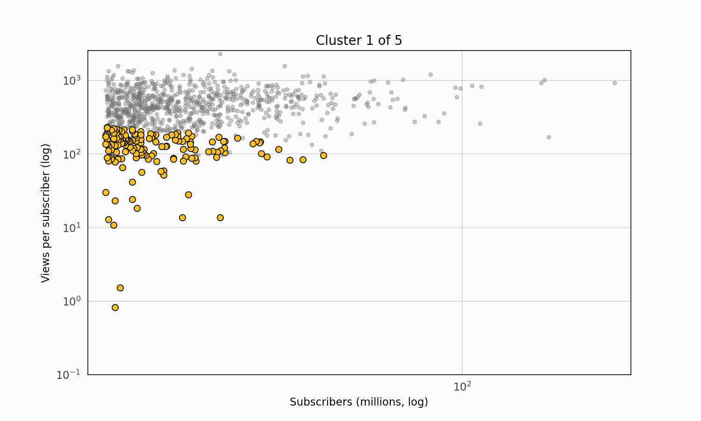

# Five Archetypes at the Top of YouTube: Creator Segmentation on the Global Top-995

The Global YouTube Statistics 2023 dataset has 995 top creators profiled at a single moment in mid-2023, with subscriber counts, lifetime video views, upload counts, country, category, and a handful of derived statistics. It is very much a snapshot — numbers have shifted since — so the useful work isn't forecasting anything forward. It's finding the structure in what's there. KMeans at k=5 produces a segmentation that maps cleanly onto five recognisable archetypes of top creator, which is a more interesting output than another ranking of MrBeast.

## The data

995 rows, 28 columns. 949 of the rows survive a basic filter for positive subscriber count, video views, and upload count. 48 countries represented. The dataset is scraped from Social Blade and was last updated mid-2023, which means the numbers are a sample at a point in time rather than a live API response.

The variables that matter for segmentation: subscribers, lifetime video views, total uploads, plus three derived ratios — views per subscriber (engagement efficiency), views per upload (virality per video), and uploads per million subscribers (posting frequency normalised to channel size). Log-transforming before standardising brings the feature scales into a range where KMeans doesn't get dominated by subscribers alone.

The US leads with the largest share of channels. India and Brazil are close seconds (India punches above its per-capita weight; Brazil below). The long tail of single-digit-count countries extends through most of the rest of Latin America, Europe, and the Gulf.

Entertainment dominates the category ranking at 241 channels, followed by Music (201), People & Blogs (141), and Gaming (90). Education sits mid-pack at 46. News & Politics is notably sparse at 26, which makes sense given the dataset is drawn from top-subscriber-count channels rather than top-influence channels.

## Subscribers vs. views is loosely linear

On log scale, subscribers and views trace a roughly linear relationship — roughly an order of magnitude more views per order of magnitude more subscribers, consistent with the intuition that "more subscribers means more views, approximately proportionally". The scatter around that line is what the clustering picks apart.

## Elbow says k=5

I swept k from 2 to 10 and looked at the SSE curve. The bend sits between k=4 and k=5, and at k=5 the resulting clusters separate interpretably — adding a sixth cluster splits one of the existing groups along a dimension that doesn't correspond to an obvious archetype.

## Five archetypes

| Cluster | Median subs | Median views | Median uploads | Views/sub | Count | Label |
| ---: | ---: | ---: | ---: | ---: | ---: | --- |
| 0 | 36.5M | 22.6B | 1,331 | 592 | 135 | **Mega-scale creators** |
| 1 | 16.0M | 7.5B | 719 | 436 | 367 | **Mainstream large channels** |
| 2 | 14.9M | 2.2B | 461 | 133 | 158 | **Underperforming-on-engagement large channels** |
| 3 | 20.7M | 9.4B | 12 | 445 | 114 | **Music-video channels** |
| 4 | 16.9M | 9.5B | 10,022 | 548 | 175 | **Upload machines** |

The labels are my reading, not the data's — but the clusters align with recognisable patterns.

**Cluster 0** is the top-tier scale phenomenon. 36M median subscribers, 22B median views, 1,331 uploads. That's Mr. Beast, PewDiePie, the top 10 individual creators plus a hundred others at similar scale. The views-per-subscriber figure of 592 means each subscriber on average has watched 592 videos across the channel's lifetime — viewer depth per subscriber is extremely high.

**Cluster 1** is the mainstream large-channel cluster — 367 channels at 16M median subscribers and 7.5B median views. Big channels, not mega-scale. This is the largest bucket in the segmentation.

**Cluster 2** is interesting for what's missing. 14.9M median subscribers but only 2.2B median views. Views per subscriber is 133 — less than a quarter of the other clusters. These are channels with large subscriber counts but comparatively low engagement per subscriber. The explanation is usually one of two things: the subscribers were accumulated during a past hit run and most don't watch new content (common for kids'-content channels that acquired subscribers via YouTube's recommendation algorithm in 2015-2020), or the channel's audience is highly fragmented across shorter-form content where only a subset watches each upload.

**Cluster 3** is the music-video cluster. Median 12 uploads — an order of magnitude smaller than any other cluster. These channels have 20M subscribers and 9B views across just a handful of extremely viral videos. This is where the major-label music channels and the one-hit-wonder channels sit. Views per upload is 668 million — by far the highest in the dataset, because each video is a full music release that accumulates hundreds of millions of plays.

**Cluster 4** is the upload-machine cluster. 10,022 median uploads, 16.9M subscribers, 9.5B views. News networks, clip compilation channels, daily-vlog channels, and automated content farms. Views per upload is just 767,000 — two orders of magnitude below the music-video cluster — but high posting volume compensates.

The two-dimensional scatter shows the clusters separating most cleanly on views-per-subscriber. Cluster 2 sits visibly below; cluster 0 sits visibly above; the others overlap in the middle band. Subscribers alone would not have separated these groups.

The reveal animation steps through clusters from smallest to largest median-subscriber, highlighting each one on top of a faded scatter of the full population.

## Country density per capita

Channels per capita paints a different ranking than raw channel count. Small English-speaking countries with concentrated creator economies punch above their weight — New Zealand, Ireland, Canada, the Netherlands. The US sits mid-pack once the calculation is per-capita; India ranks low once the 1.4 billion population is divided through. That's a reminder that the global top-995 is a top-subscriber-count list, not a top-influence-per-population list.

## Estimated earnings by category

The earnings estimates come from Social Blade's reported lowest-to-highest yearly earnings bands; I took the midpoint. Treat the absolute numbers with significant skepticism — they're rough estimates based on view count and an assumed CPM. The category ordering is probably more trustworthy than the absolute levels. News, Movies, and Entertainment top the ranking; Education and Science & Technology sit lower.

## What this isn't

Not a longitudinal analysis. The dataset is one snapshot from mid-2023, and the numbers have shifted since. Anyone drawing conclusions about creator-economy trends from this data is extrapolating from a single observation.

Not a representative sample of YouTube creators. It's the top 995 by subscriber count. The subscriber distribution on YouTube is long-tailed enough that the top 995 captures a vanishingly small fraction of the creator population but a significant fraction of total viewing hours. Any conclusions generalise only to the top of the distribution.

The earnings numbers are estimates. Social Blade's "lowest to highest yearly earnings" is a CPM-based computation on view counts, not actual revenue. Creators routinely make more or less than those bands depending on sponsorship deals, merch, brand partnerships, and content type. The midpoint I used is an illustrative statistic, not a validated ground truth.

## References

Nelgiriye Withana, N. (2023). *Global YouTube Statistics 2023* [Data set]. Kaggle. https://www.kaggle.com/datasets/nelgiriyewithana/global-youtube-statistics-2023

Social Blade. (2023). *YouTube rankings and statistics*. https://socialblade.com

MacQueen, J. (1967). Some methods for classification and analysis of multivariate observations. *Proceedings of the Fifth Berkeley Symposium on Mathematical Statistics and Probability*, 1, 281-297.
